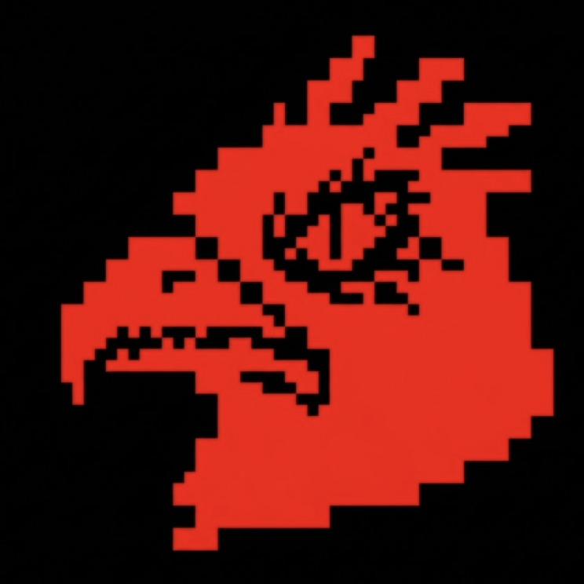

<div align="center">
  
  <h1>r4venOS - custom firmware </h1>
  
  <p><b>A small hacking playground focused on WiFi experimentation, simple crypto tools, and hardware tinkering.</b></p>

  
  
  
  
  
</div>


---

## Overview

**r4venOS** is a lightweight custom firmware for the **ROOTEDCON 2026 ESP32 badge**.

The original badge firmware included a custom pac-man themed firmware. This project replaces it with a minimal toolkit focused on **WiFi exploration, security experimentation, and badge hacking**.

The idea is not to build a huge framework, but a **simple and fun firmware to explore what the badge hardware can do**.

Everything runs directly on the ESP32 and the interface stays intentionally minimal to keep it fast and lightweight.

---

## Installation

Flash the firmware using **PlatformIO**.

```
git clone https://github.com/aherreros-dev/ravenOS_rooted26_badge.git
cd ravenOS_rooted26_badge
pio run --target upload
```

After uploading, reboot the badge and the r4venOS menu should appear.

---

## Features

### WiFi Tools

* **WiFi Scanner**
Scans nearby networks and shows SSID, signal strength, and channel.

* **Twin Detect**
Looks for duplicate SSIDs that could indicate an Evil Twin setup.

* **WiFi Deauth**
Sends deauthentication frames to a selected access point.

* **Evil Twin**
Creates a test access point with a captive portal.

* **Beacon Spam**
Broadcasts multiple fake network names.

---

### Crypto & Utilities

* **Cipher Tool**
Encodes text using a simple Caesar shift and XOR.

* **Hash Tool**
Generates MD5 and SHA256 hashes.

* **System Logs**
Stores recent events locally on the badge.

---

## Controls

| Button       | Action                         |
| ------------ | ------------------------------ |
| UP / DOWN    | Navigate menus                 |
| LEFT / RIGHT | Change pages                   |
| SELECT       | Confirm / run tool             |
| EXTRA        | Go back or stop current action |

---
## Pinout

**Core:** ESP32 DevKit
**Display:** 1.77" ST7735 TFT (128x160)

### Display Interface (SPI)

| Function      | ESP32 GPIO | Notes                              |
| :------------ | :--------: | :--------------------------------- |
| **MOSI**      |    `23`    | Master Out Slave In                |
| **SCLK**      |    `18`    | Serial Clock                       |
| **CS**        |     `5`    | Chip Select                        |
| **DC**        |    `16`    | Data / Command                     |
| **RST**       |     `4`    | Reset                              |
| **BL**        |    `12`    | Backlight (Active LOW)             |
| **SCREEN_EN** |    `21`    | Display Power Enable (Active HIGH) |

### Input Matrix (D-Pad)

*All buttons use `INPUT_PULLUP` and trigger on `LOW`.*

| Button         | GPIO | Navigation Action                    |
| :------------- | :--: | :----------------------------------- |
| **UP**      | `27` | Move up / Scroll backward            |
| **DOWN**    | `15` | Move down / Scroll forward           |
| **LEFT**   | `25` | Previous page / secondary navigation |
| **RIGHT**  | `26` | Next page / secondary navigation     |
| **SELECT** | `13` | Confirm / run tool                   |
| **EXTRA**   | `33` | Back / stop action / lock badge      |

---

## Why this project exists

This started as a **badge hacking experiment during ROOTEDCON 2026**.

Main goals:

* Explore how the badge hardware works.
* Replace the original firmware with something custom.
* Experiment with ESP32 WiFi features.
* Build a small hacking playground for the badge.

The project is intentionally simple and meant for **learning, experimenting, and having fun with hardware badges**.

---

## Disclaimer

This project is intended **for educational purposes and authorized testing only**.

Features like deauthentication or rogue access points may be illegal if used against networks without permission. Always make sure you have **explicit authorization** before testing any infrastructure.

The author assumes no responsibility for misuse.

---


<p align="center">
  
</p>


